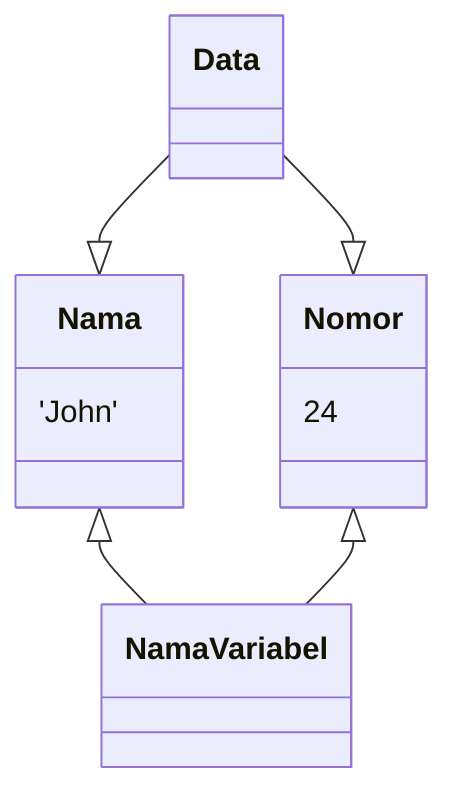
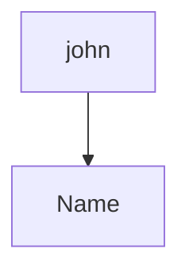
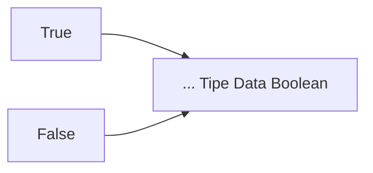

# Mari mulai Belajar Python
Mari kita mempelajari dasar-dasar Python, salah satu bahasa pemrograman paling populer di dunia.
Di akhir pelajaran, kita akan membuat aplikasi sederhana untuk menghitung total belanja Anda.

Python adalah bahasa pemrograman yang sederhana dan mudah dimengerti. Python dapat di gunakan dalam pengembangan web, machine learning, pemrosesan statistik, dan banyak lagi.


# String
Ayo jalankan program Python pertama kita!

Anda dapat menampilkan karakter dengan mengetik. 
```python
print()
```
contoh
```python
print("hello world")
```

Karakter di dalam tanda kurung akan ditampilkan di dalam `console`.


Dalam Python, urutan karakter seperti `"Hello Python"` disebut `string`.
String harus ditutup dengan tanda kutip atau kutip ganda.
Hasilnya akan sama.
Jika Anda tidak menambahkan tanda kutip, hasilnya akan error.


# Komentar
Menambahkan <kbd>#</kbd> pada awal perintah akan membuat baris perintah itu menjadi komentar.
```python
#ini komentar
```
Komentar tidak akan muncul ketika code dijalankan sehingga Anda bisa menggunakannya untuk catatan.

# Integer
Anda dapat menggunakan integer (bilangan bulat) dalam pemrograman. Tidak seperti string, `integer tidak memerlukan tanda kutip`. Anda dapat menambah dan mengurangi integer, seperti dalam matematika. Spasi sebelum dan sesudah operator tidak diperlukan, namun akan membuat code lebih mudah dibaca.
```python
print(3+5)
#jangan apit nomor dalam kutipan
```
## Perbedaan string dan integer
String dan integer diinterpretasikan berbeda dalam pemrograman.
Seperti pada gambar di bawah, <kbd>3 + 5</kbd> akan menghasilkan <kbd>8</kbd>, hasil penambahannya. Akan tetapi, jika Anda memakai tanda kutip dan membuatnya tipe data string, hasilnya akan menjadi <kbd>3 + 5</kbd>.
```python
print(3+5)
#ini integer
```
```python
print("3+5")
#ini string
```

# Perhitungan
Dalam Python, Anda dapat melakukan perhitungan lain seperti perkalian dan pembagian, namun dengan simbol yang berbeda dengan yang biasanya Anda pakai dalam matematika.
<kbd>*</kbd> adalah simbol perkalian dan <kbd>/</kbd> adalah simbol pembagian.
Anda juga dapat menghitung sisa pembagian dengan <kbd>%</kbd>.
```python
print(3+5)
print(8/2)
print(7%3)
```

# Variabel

Selanjutnya, kita akan belajar mengenai `variable`.
Variable dapat diumpamakan seperti kotak yang memiliki nama dimana Anda dapat menyimpan nilai.

konsep variabel

## Mendefinisikan Variable
Untuk menyimpan nilai dalam variable, Anda perlu mendefiniskan variable. Anda dapat melakukannya dengan format berikut: `variable_name = nilai`. Operator <kbd>=</kbd> dalam Python bukan berarti "sama dengan". Operator tersebut digunakan untuk `menetapkan nilai ke variable yang berada di sebelah kiri`. Nama variable tidak perlu ditutup dengan tanda kutip.

```python
nama = "john"
```
`nama = variable | "john" = nilai`


## Mencetak Variabel
Sekarang mari belajar cara mencetak nilai pada variable `name`.
Anda dapat melakukannya dengan menulis `print(name)`.
Jika Anda menambahkan tanda kutip pada variable, seperti `print('name')`, name menjadi string, bukan variable.
Maka dari itu, hasilnya akan menjadi `name`, bukan nilai dari variable.
```python
name = "john"
print(name) #nilai dari variabel name
print("john") #nilai dari string, 'john'
```

## Menggunakan Variable
### Bagaimana Cara Menamai Variable
Anda dapat memilih nama apapun untuk variable, namun ada beberapa aturan yang harus diikuti.
Contohnya, Anda tidak bisa mengawali nama variable dengan angka.
Selain itu, jika nama variable terdiri dari lebih dari dua kata, seperti `user_name`, Anda harus memisahkannya dengan <kbd>_</kbd>.
> `date` #menggunakan huruf kecil
`user_name` #pisahkan menggunakan garis bawah{.is-success}

> `a` #tidak deskriptif
`1data` #mulai dengan angka{.is-danger}

> `userName` #campuran huruf besar dan kecil{.is-warning}


### Pentingnya Variable (1)
Sejauh ini, kita telah mempelajari bagaimana menggunakan dan memberi nama variable. Namun mengapa programmer menggunakannya? Salah satu alasannya adalah melabeli data membantu kita memahami variable dari nilai tersebut dan menjadikan code lebih mudah dibaca.

- Code dengan variabel

```python
apple_count = 3 #Deskriptif
apple_price = 10 #Deskriptif
total_price = apple_count * apple_price
print(total_price) #asil: 30
```
- Code tanpa variabel
```python
total_price= 3 * 10 #Sulit untuk mengetahui apa arti dari angka ini
print(total_price) #Hasil: 30
```

### Pentingnya Variable (2)
Kegunaan lain dari variable adalah sebagai berikut:
・Anda dapat menggunakan data yang sama berulang kali.
・Jika Anda ingin mengganti nilai dari variable, Anda hanya perlu menggantinya sekali.

- Code dengan variabel

```python
# Kalkulasikan area sebuah persegi
length = 5 # Dapat menggunakan data yang sama dua kali
area = length * length
print(area) #Hasil: 25
```
- Code tanpa variabel

```python
# Kalkulasikan area sebuah persegi
area = 5 * 5 # Butuh untuk menggantikan nilai berulang kali jika mau diubah

print(area) #Hasil: 25
```
## Memperbarui Variable
### Memperbarui Nilai Variable (1)
Kita akan memperbarui nilai dari variable yang sudah didefinisikan.
Anda dapat menulis kembali variable dengan nilai baru.
Pada gambar di bawah, hasilnya berubah karena nilai diperbarui.
```python
# Tetapkan variabel X
x = 5
print(x)
x = 11 # Gantikan nilai dengan menetapkan variabel 11 ke variabel x
# Nilai x yang semula 5 kemudian ditetapkan menjadi 11
print(x)
```
### Memperbarui Nilai Variable (2)
Jika Anda ingin menambahkan nilai sebuah variable, Anda dapat menetapkan jumlah dari variable tersebut dan angka ke variable itu sendiri. Ini terlihat aneh, namun perlu diingat bahwa <kbd>=</kbd> berarti `menetapkan`, bukan `sama dengan`.
```python
# Tetapkan variabel x
x = 5
print(x)
x = x + 3 # tambakan 3 ke variabel x
# Nilai dari variabel x diubah menjadi 8
print(x)
```

### Memperbarui Nilai Variable (3)
Anda dapat menggunakan operator yang dipersingkat sepeti gambar di bawah saat memperbarui variable yang memiliki nilai integer.
Semua jenis perhitungan memilki sintaksis sejenis.

|Standar||Singkatan|
|:--|:--|
|x = x + 10|->|x += 10|
|x = x - 10|->|x -= 10|
|x = x * 10|->|x *= 10|*
|x = x / 10|->|x /= 10|
|x = x % 10|->|x %= 10|

# Penggabungan String
Operator + yang kita gunakan untuk perhitungan juga dapat digunakan untuk menggabungkan string. Penggabungan string disebut `string concatenation`. Penggabungan string dapat digunakan untuk string dan variable yang mempunyai tipe data string.
```python
print("hello "+"python") # + berguna sebagai penggabung string
name = "john"
print("nama saya "+name) # Dapat menggabungkan string dan variabel
```
# Tipe-tipe Data
Sejauh ini, kita sudah mengenal `string dan integer`. Ini disebut tipe data. Ada tipe-tipe data lain di Python, namun mari kita mempelajari keduanya terlebih dahulu.
```python
`Hello Python` ... Tipe String
3 ... Tipe Integer
```
## Perbedaan Dalam Tipe-tipe Data
Tipe yang berbeda memiliki sifat yang berbeda.
Contohnya, `print(5 + 7)` menghitung penjumlahannya sedangkan `print('5' + '7')` menggabungkan string.
```python
print(5 + 7) <------- Kalkulasi Numerik
# Hasil: 12
print(`5` + `7`) <------ Penggabungan String
# Hasil: 57
```
## Konversi Tipe: str()
Seperti bisa dilihat pada gambar sebelah kiri, Anda tidak bisa menggabungkan string dan integer karena tipe data keduanya berbeda. Untuk menggabungkan dua tipe data, Anda harus melakukan `konversi tipe`. Pada contoh di bawah, Anda harus mengonversi integer ke string, menggunakan `str()`.

- belum dikonversi
```python
price = 3
print("Harga apel " + price "dolar")
#    "harga apel"    --> string			 
#     price          --> integer 
#    "dolar"         --> string

TypeEror: Cant' convert 'int' object to str implicity
# Tidak bisa menggabungkan tipe string dan integer
```
- Sudah terkonversi
```python
price = 3
print("Harga apel " + str(price)+ "dolar")
# Str mengubah integer ke string
```
## Konversi Tipe: int()
Anda juga tidak dapat melakukan perhitungan dengan string dan integer.
Anda harus mengonversi tipe data string ke integer menggunakan `int()`.

```python
count = "3"
price = 100
total_price = price * int(count) # penggunaan Int
# Int mengubah string ke integer

print(total_price)
#Hasil: 300
```

# Statement if
## Control Flow

KIta akan belajar mengenai `control flow` sekarang.
Dalam pemrogramman, kita seringkali ingin mengontrol jalannya code berdasarkan kondisi-kondisi yang dipenuhi.
Sebagai contoh, Anda ingin mengatakan 'Bagus!' (hasil) hanya jika skor 100% (kondisi).

## Statement If
Dengan menggunakan statement `if`, Anda dapat menulis code yang dapat dijalankan hanya jika kondisi dipenuhi.
Anda dapat membuat statement `if` dengan menulis `if`, diikuti `conditional expression` dan tanda titik dua <kbd>:</kbd>.
Code di baris berikutnya akan berjalan jika kondisi benar.
```python
score = 100
if score == 100:		 <--- Jika kondisinya True
		print("Bagus!")  <--- Jalankan code ini
#Hasil: Bagus!
```

## Conditional Expression
Ada banyak `operator` untuk membuat conditional expression.
Mari kita lihat `operator perbandingan`, yang dapat digunakan untuk membandingkan kesetaraan kedua nilai.
Kita dapat menggunakan == untuk mengetahui jika kedua nilai sama, dan != untuk mengetahui jika kedua nilai tidak sama.
- Operator perbandingan
> x == y ... True jika nilai di kiri dan kanan setara{.is-info}

> x!= ... True jika nilai di kiri dan kanan tidak setara{.is-info}

- Contoh
```python
score = 100
if score == 100 :
	.
	.
	.

```
## Indentasi
Anda harus `mengindentasi` code Anda jika menulis statement `if`.
Code yang diindentasi di bawah statement if hanya akan berjalan jika kondisi benar. Bagian yang tidak diindentasi akan berjalan tidak peduli kondisi benar atau tidak.

```python
score = 50
if score == 100:
___print("Bagus!")						<--- masuk ke statement if
___print("terus lanjutkan!")	<--- masuk ke statement if
# Indentasikan code secara konsisten (4 spasi atau 1 tab)

# Karena kondisinya false,tidak ada yang dicetak.
```
```python
score = 50
if score == 100:
	 print("Bagus!")						<--- masuk ke statement if
print("terus lanjutkan!")		 <--- tidak masuk ke statement if

#Hasil: "terus lanjutkan!"
```
# Booleans
## Tab {.tabset}
## True and False
Mari kita mencoba untuk memahami bagaimana `conditional expression` bekerja. Saat Anda mencetak kondisi seperti <kbd>score == 100</kbd>, <kbd>True</kbd> akan muncul. Apa nilai <kbd>True</kbd>?
```python
if score == 100:
	 print("Bagus!")
```
```python
score == 100
print(score == 100)

#Hasil: True
```
## Booleans

`True` adalah nilai tipe data boolean.
Tipe data boolean hanya mempunyai dua nilai, `True` dan `False`. `True` akan muncul jika kondisi dipenuhi, dan `False` jika tidak.
Perlu diingat bahwa Anda harus menulis huruf pertama `True` dan `False` dalam huruf kapital.
- Booleans

```python
print(3 == 3) --> True
print(3 == 5) --> False

#Hasil
-->     True
--> 		False
```

## Statement If dan Nilai Boolean
Mari kita mundur ke statement if untuk melihat interaksinya dengan nilai boolean. Code di bawah statement if dapat dijalankan apabila memenuhi kondisi `True`, dan tidak dapat dijalankan apabila memenuhi kondisi `False`.

```python
score = 100
if score == 100: --> True
	 print("Bagus!")

#Hasil: Bagus! --> Karena kodisinya true, code di dalam if akan di jalankan
```
```python
score = 50
if score == 100: --> False
	 print("Bagus!")

# Karena kondisinya False, code didalam if TIDAK di jalankan
```

## Operator Perbandingan (<, <=, >, >=)
Ada operator-operator lain yang dapat digunakan untuk membandingkan nilai. Seperti dalam matematika, Anda dapat menggunakan `<` dan `>` untuk membandingkan angka.
Anda juga dapat menggunakan `>=` dan `<=` jika perbandingannya inklusif.

- Operator Perbandingan (<, <=, >, >=)
> x **<** y **TRUE** jika x lebih kecil dari y
> x **<=** y **TRUE** jika x lebih kecil dari atau sama dengan y{.is-info}

> x **>** y **TRUE** jika x lebih besar dari y
> x **>=** y **TRUE** jika x lebih besar dari atau sama dengan y{.is-info}

||||
|:--|:--|:--|
|2 > 6|...|False|
|4 + 2 >= 6|...|True|
|8 / 4 < 5|...|True|
|2 * 5 <= 9|...|False:

# Statement else
## Apa yang Terjadi Jika Kondisi Salah?
Dengan menggunakan statement `if`, Anda dapat menjalankan code hanya jika kondisinya `True`.
Selanjutnya, mari belajar cara membuat statement control flow yang dapat menjalankan code berbeda saat kondisi `False`.

## Else
Dengan menggunakan pernyataan `else`, Anda dapat menambahkan code yang ingin Anda jalankan jika kondisi statement `if` adalah False.
```python
score = 50
if score == 100: --> False
	print("Bagus!")
else:
__print("Belajar lagi!") # Indentasi harus digunakan dengan benar
# dijalankan jika conditional expression bernilai False

#Hasil: Belajar lagi!
```

# Statement elif
## elif (1)
Anda dapat menggunakan `elif` untuk menambah kondisi alternatif pada control flow. Cek contoh `elif` di bawah!

```python
score = 70
if score == 100: <-- False
	print("Bagus!")
elif score >= 60:
	print("Tidur buruk") <-- kode ini dijalankan
else:
	print("Belajar lebih baik!")

#Hasil: Tidak buruk
```