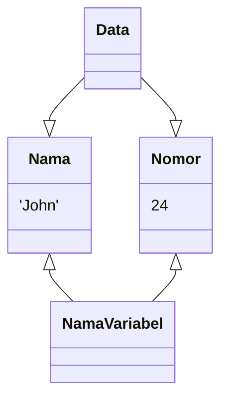
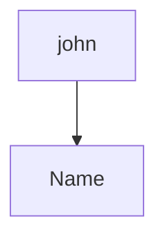

# Mari mulai Belajar Python
Mari kita mempelajari dasar-dasar Python, salah satu bahasa pemrograman paling populer di dunia.
Di akhir pelajaran, kita akan membuat aplikasi sederhana untuk menghitung total belanja Anda.

Python adalah bahasa pemrograman yang sederhana dan mudah dimengerti. Python dapat di gunakan dalam pengembangan web, machine learning, pemrosesan statistik, dan banyak lagi.

# String
Ayo jalankan program Python pertama kita!

Anda dapat menampilkan karakter dengan mengetik. 
```python
print()
```
contoh
```python
print("hello world")
```

Karakter di dalam tanda kurung akan ditampilkan di dalam `console`.


Dalam Python, urutan karakter seperti `"Hello Python"` disebut `string`.
String harus ditutup dengan tanda kutip atau kutip ganda.
Hasilnya akan sama.
Jika Anda tidak menambahkan tanda kutip, hasilnya akan error.


# Komentar
Menambahkan <kbd>#</kbd> pada awal perintah akan membuat baris perintah itu menjadi komentar.
```python
#ini komentar
```
Komentar tidak akan muncul ketika code dijalankan sehingga Anda bisa menggunakannya untuk catatan.

# Integer
Anda dapat menggunakan integer (bilangan bulat) dalam pemrograman. Tidak seperti string, `integer tidak memerlukan tanda kutip`. Anda dapat menambah dan mengurangi integer, seperti dalam matematika. Spasi sebelum dan sesudah operator tidak diperlukan, namun akan membuat code lebih mudah dibaca.
```python
print(3+5)
#jangan apit nomor dalam kutipan
```
## Perbedaan string dan integer
String dan integer diinterpretasikan berbeda dalam pemrograman.
Seperti pada gambar di bawah, <kbd>3 + 5</kbd> akan menghasilkan <kbd>8</kbd>, hasil penambahannya. Akan tetapi, jika Anda memakai tanda kutip dan membuatnya tipe data string, hasilnya akan menjadi <kbd>3 + 5</kbd>.
```python
print(3+5)
#ini integer
```
```python
print("3+5")
#ini string
```

# Perhitungan
Dalam Python, Anda dapat melakukan perhitungan lain seperti perkalian dan pembagian, namun dengan simbol yang berbeda dengan yang biasanya Anda pakai dalam matematika.
<kbd>*</kbd> adalah simbol perkalian dan <kbd>/</kbd> adalah simbol pembagian.
Anda juga dapat menghitung sisa pembagian dengan <kbd>%</kbd>.
```python
print(3+5)
print(8/2)
print(7%3)
```

# Variabel

Selanjutnya, kita akan belajar mengenai `variable`.
Variable dapat diumpamakan seperti kotak yang memiliki nama dimana Anda dapat menyimpan nilai.

konsep variabel

## Mendefinisikan Variable
Untuk menyimpan nilai dalam variable, Anda perlu mendefiniskan variable. Anda dapat melakukannya dengan format berikut: `variable_name = nilai`. Operator <kbd>=</kbd> dalam Python bukan berarti "sama dengan". Operator tersebut digunakan untuk `menetapkan nilai ke variable yang berada di sebelah kiri`. Nama variable tidak perlu ditutup dengan tanda kutip.

```python
nama = "john"
```
`nama = variable | "john" = nilai`


## Mencetak Variabel
Sekarang mari belajar cara mencetak nilai pada variable `name`.
Anda dapat melakukannya dengan menulis `print(name)`.
Jika Anda menambahkan tanda kutip pada variable, seperti `print('name')`, name menjadi string, bukan variable.
Maka dari itu, hasilnya akan menjadi `name`, bukan nilai dari variable.
```python
name = "john"
print(name) #nilai dari variabel name
print("john") #nilai dari string, 'john'
```


## Bagaimana Cara Menamai Variable
Anda dapat memilih nama apapun untuk variable, namun ada beberapa aturan yang harus diikuti.
Contohnya, Anda tidak bisa mengawali nama variable dengan angka.
Selain itu, jika nama variable terdiri dari lebih dari dua kata, seperti `user_name`, Anda harus memisahkannya dengan <kbd>_</kbd>.
> `date` #menggunakan huruf kecil
`user_name` #pisahkan menggunakan garis bawah{.is-success}

> `a` #tidak deskriptif
`1data` #mulai dengan angka
`userName` #campuran huruf besar dan kecil{.is-danger}

## Pentingnya Variable (1)
Sejauh ini, kita telah mempelajari bagaimana menggunakan dan memberi nama variable. Namun mengapa programmer menggunakannya? Salah satu alasannya adalah melabeli data membantu kita memahami variable dari nilai tersebut dan menjadikan code lebih mudah dibaca.

- Code dengan variabel

```python
apple_count = 3 #Deskriptif
apple_price = 10 #Deskriptif
total_price = apple_count * apple_price
print(total_price) #asil: 30
```
- Code tanpa variabel
```python
total_price= 3 * 10 #Sulit untuk mengetahui apa arti dari angka ini
print(total_price) #Hasil: 30
```
---
## Pentingnya Variable (2)
Kegunaan lain dari variable adalah sebagai berikut:
・Anda dapat menggunakan data yang sama berulang kali.
・Jika Anda ingin mengganti nilai dari variable, Anda hanya perlu menggantinya sekali.

- Code dengan variabel

```python
# Kalkulasikan area sebuah persegi
length = 5 # Dapat menggunakan data yang sama dua kali
area = length * length
print(area) #Hasil: 25
```
- Code tanpa variabel

```python
# Kalkulasikan area sebuah persegi
area = 5 * 5 # Butuh untuk menggantikan nilai berulang kali jika mau diubah

print(area) #Hasil: 25
```
---
## Memperbarui Nilai Variable (1)
Kita akan memperbarui nilai dari variable yang sudah didefinisikan.
Anda dapat menulis kembali variable dengan nilai baru.
Pada gambar di bawah, hasilnya berubah karena nilai diperbarui.
```python
# Tetapkan variabel X
x = 5
print(x)
x = 11 # Gantikan nilai dengan menetapkan variabel 11 ke variabel x
print(x)
```
