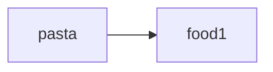
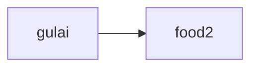
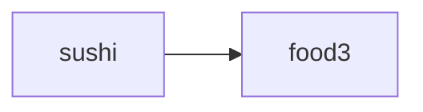
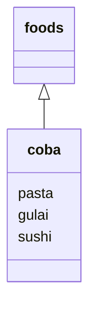

# Mari Mulai
Pada pelajaran ini, kita akan belajar bagaimana mengelola kumpulan data dan bekerja dengan loop.
Kita juga akan memperbarui aplikasi belanja dengan pengetahuan baru ini.
Tidak akan sesulit kedengarannya, kok. Santai!
# Menyusun Data
## List
### Menyusun Data
Mari belajar bagaimana mengelola sekelompok data dengan satu variable. Ketika ada daftar nama-nama makanan, sebagai contoh, tidak efisien untuk menamainya dengan variable terpisah, seperti `food1`, `food2`, `food3`. Akan lebih baik untuk mempunyai variable `foods` untuk mengelola keseluruhan daftar tersebut.
> **Variabel** Mengelola data secara **mandiri**
{.is-info}

> **List** Mengelola sekelompok data secara **bersamaan**
{.is-info}

