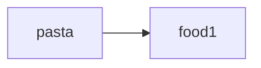
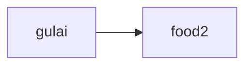
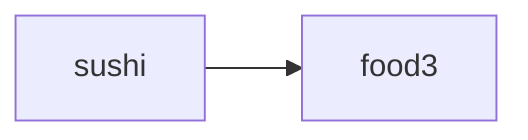
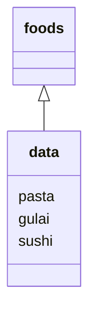
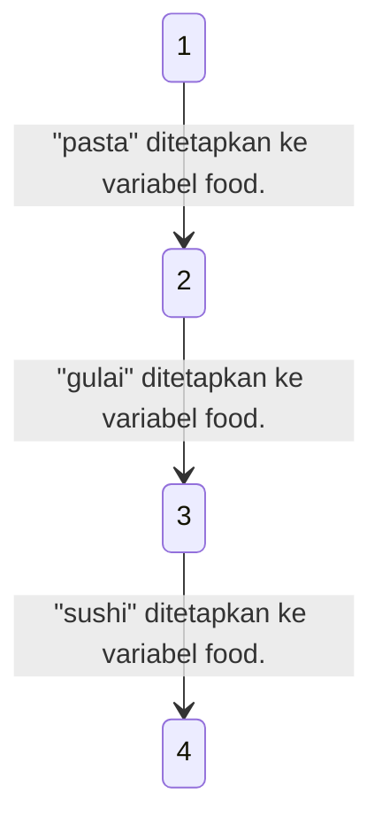

# Mari Mulai
Pada pelajaran ini, kita akan belajar bagaimana mengelola kumpulan data dan bekerja dengan loop.
Kita juga akan memperbarui aplikasi belanja dengan pengetahuan baru ini.
Tidak akan sesulit kedengarannya, kok. Santai!
# Menyusun Data
## List
### Menyusun Data
Mari belajar bagaimana mengelola sekelompok data dengan satu variable. Ketika ada daftar nama-nama makanan, sebagai contoh, tidak efisien untuk menamainya dengan variable terpisah, seperti `food1`, `food2`, `food3`. Akan lebih baik untuk mempunyai variable `foods` untuk mengelola keseluruhan daftar tersebut.
> **Variabel** Mengelola data secara **mandiri**
{.is-info}



> **List** Mengelola sekelompok data secara **bersamaan**
{.is-info}

### List (Daftar)
Tipe data `list` memungkinkan Anda untuk mengelola sekelompok data sekaligus. Anda dapat membuat list sebagai berikut: `[element1, element2, ...]`. Setiap nilai di dalam list disebut `element`.
Dengan menggunakan list, Anda dapat mengelola banyak string dan integer dalam satu grup.

Membuat List
```
[element1, element2, element3]
# Pisahakan element dengan koma
```
Penggunaan
```python
# List dari beberapa string
["pasta", "gulai", "sushi"]

# List dari beberapa integer
[1, 2, 3, 5, 8, 13, 21]

# List dari item gabungan
[["apel", "pisang", 200, 300]
```
### Menetapkan List ke Variable
Seperti integer dan string, Anda dapat menentukan list ke dalam satu variable. Sesuai norma penamaan yang berlaku, nama variable bersifat plural, seperti `foods`, karena variable akan mengandung banyak element.

```python
foods = ["pasta", "gulai", "sushi"]  # foods = nama variabel
print(foods)

#Hasil: ["pasta", "gulai", "sushi"]
# List dicetak sebagaimana adanya
```

### Menentukan Element dalam List
Setiap element list dinomori `0, 1, 2, ....`
Ini disebut `nomor indeks`. Nomor indeks dimulai dari `0`. Anda bisa mendapatkan element individual dengan menulis `list[index]`.

Index
```python
["pasta", "gulai", "sushi]
	  0				1					2

# dimulai dari index 0
```
```python
foods = ["pasta", "gulai", "sushi"]
print("saya suka " + foods[2]) # Mengambil element menggunakan nomor index

# Element dengan index 2 dicetak
# Hasil: Saya suka sushi
```
## Memperbarui dan Menambah Element-Element List
### Memperbarui Element Pada List
Mari kita mencoba untuk memperbarui element pada list.
Ini dapat dilakukan dengan menulis `list[index] = nilai`.
```python
foods = ["pasta", "gulai", "sushi"] 
foods[1] = "pizza" # Memperbarui element index 1 
print(foods)

#Hasil: ["pasta", "gulai", "sushi"]
# Element di index 1 diperbarui
```
### Menambah Element Pada List
Anda juga dapat menambah element pada list.
Dengan menulis `list.append(nilai)`, Anda dapat menambahkan element baru pada akhir sebuah list.
```python
foods = ["pasta", "gulai", "sushi"] 
foods.append("pizza") # Menambah element ke akhir list 
print(foods)

#Hasil: ["pasta", "gulai", "sushi", "pizza]
# Sebuah element ditambahkan
```

## Loop for
### Mencetak Semua Element
Jika Anda ingin mencetak semua element pada list, tidak efisien untuk mengulang code yang sama seperti contoh pada gambar di sebelah kiri.
Anda dapat menggunakan `loop for` untuk memudahkan Anda mencetak semua element.
```python
foods = ["pasta", "gulai", "sushi"]
print("Saya suka " + foods[1])
print("Saya suka " + foods[2])
print("Saya suka " + foods[3])
# Mencetak satu per satu tidak efisien

#Hasil:
#Saya suka pasta
#Saya suka gulai
#Saya suka sushi
```

### Loop for
Loop `for` memudahkan Anda untuk memproses setiap element pada list dengan temporary variable (variable sementara) dan mengaplikasikan code yang sama.
Pada contoh di bawah, tiap element pada variable `foods` disimpan pada variable sementara, yaitu `food` dan dicetak.
```python
foods = ["pasta", "gulai", "sushi"]
for food in foods:  #food = temporary variable    
		print("Saya suka " + food)
    
#Hasil:
#Saya suka pasta
#Saya suka gulai
#Saya suka sushi
```

### Alur Loop for
Element pada list akan ditentukan ke temporary variable satu per satu, dan code dalam loop `for` akan dijalankan untuk tiap penempatannya. Hal ini disebut `iterasi`. Umumnya, kita memakai bentuk singular dari nama list untuk temporary variable, namun ini bisa apapun. Tidak ada aturan khusus.

contoh
```python
foods = ["pasta", "gulai", "sushi"]
for food in foods:  # list nama makanan akan masuk ke variabel food    
		print("Saya suka " + food) # Bagian dari loop
```
cara kerja loop for

## Dictionary
### Dictionary
Seperti list, dictionary python digunakan untuk mengelola kelompok data. Perbedaannya adalah dictionary menggunakan `kunci (key)` daripada `nomor index`. Pada dictionary, sebuah kunci dipasangkan dengan sebuah nilai (value) untuk membentuk satu element. Hal ini juga dikenal sebagai pasangan `kunci-nilai (key-value)`.

### Bagaimana Cara Membuat Dictionary
Anda dapat membuat dictionary sebagai berikut: `{kunci1: nilai1, kunci2: nilai2, ..}`. Pada kebanyakan kasus, kita menggunakan string sebagai kunci. Dictionary ditutup dengan tanda `{}` sementara list ditutup dengan tanda `[]`. Jangan lupa untuk menulis `:` diantara pasangan kunci dan nilai, dan `,` diantara element-element.
```python
fruits = {"apel": "merah", "pisang":"kuning", "anggur":"ungu"}
```
### Urutan Element-Element pada Dictionary
Saat Anda mencetak sebuah dictionary seperti pada contoh di bawah, urutan element yang tercetak bisa berbeda dari urutan yang Anda mendefinisikannya. Ini dikarenakan, tidak seperti list, `dictionary` tidak memiliki urutan yang tetap sebelum Python versi 3.7.
```python
fruits = {"apel": "merah", "pisang":"kuning", "anggur":"ungu"}
print(fruits)

#Hasil: {"apel": "merah", "pisang":"kuning", "anggur":"ungu"}
```
### Mendapatkan Element pada Dictionary
Anda bisa mendapatkan nilai dari dictionary menggunakan kunci dengan menulis `nama_dictionary[kunci]`.
```python
fruits = {"apel": "merah", "pisang":"kuning", "anggur":"ungu"}
print("Apel berwarna" + fruits["apel"]) # Mendapatkan nilai berdasarkan kunci yang terkait

#Hasil: Apel berwarna merah
```

## Memperbarui dan Menambah Element di Dictionary
### Memperbarui Element-Element Dictionary
Seperti pada list, Anda dapat menambah atau memperbarui element pada dictionary.
Memperbarui nilai dari kunci yang sudah ada dapat dilakukan dengan menulis `nama_dictionary[kunci]` = nilai.
```python
fruits = {"apel": "merah", "pisang":"kuning", "anggur":"ungu"}
fruits["apel"] = "hijau" # Perbarui nilainya dengan kunci "apel"

print("Apel berwarna " + fruits["apel"])

#Hasil: Apel berwarna hijau
```
### Menambah Element pada Dictionary
Menambah element dapat dilakukan dengan menggunakan sintaksis yang sama dengan memperbarui element.
Saat suatu kunci tidak ada dalam dictionary, element baru dengan kunci akan ditambahkan.
```python
fruits = {"apel": "merah", "pisang":"kuning", "anggur":"ungu"}
fruits["persik"] = "merah jambu" # menambahkan sebuah nilai dengan kunci "persik"

print(fruits)

#Hasil: {"presik": "merah jambu", "apel": "merah", "pisang":"kuning", "anggur":"ungu"}
```
## Loop for (2)
### Mendapatkan Semua Element Pada Dictionary
Seperti list, Anda dapat menggunakan loop `for` untuk melakukan pengulangan pada dictionary dengan menulis `for nama_variable in nama_dictionary:`.
Kunci dari tiap element ditentukan ke variable sementara.
Dengan demikian, Anda bisa mendapatkan nilai yang sesuai dengan variable, seperti bisa dilihat pada gambar di bawah.
```python
fruits = {"apel": "merah", "pisang":"kuning", "anggur":"ungu"}

for fruit_key in fruits: # Setiap kunci ditetapkan ke variabel "fruit_key"
		print(fruit_key + "berwarna" + fruits[fruit_key])
    
#Hasil: Apel berwarna merah
#Hasil: pisang berwarna kuning
#Hasil: Anggur berwarna ungu

```

# Bekerja dengan Loop
## Loop while
### Loop while
Anda juga dapat menggunakan `loop while` untuk mengulang code.
Dengan loop `while`, code akan diulangi sampai kondisi tertentu, seperti jika `x <= 100 `mengevaluasi `False`.
Mari belajar bagaimana cara menulis loop `while` pada slide berikutnya!

Mencetak integer 1 hingga 100 dengan loop while
```python

x = 1
while x <= 100:
		print(x)
    x += 1
    
#Hasil: 1
#       2
#       3
#       4
#       5
#       .
#       99
#       100
```
### Cara Menulis Loop While
Sintaksis untuk loop while adalah sebagai berikut:
`while <conditional expression>:`

Code pada loop while akan terus berulang selama kondisi `True`.
```python
x = 1
while x <= 100: # Conditional expression
		print(x)
    x += 1
```
### Alur Loop while
Mari belajar alur loop while dengan gambar di bawah.
Pertama-tama, variable didefinisikan sebelum loop `while`.
Pada setiap iterasi loop while, kondisi diperiksa dan variable diperbarui.
Siklus terus berlanjut sampai kondisi mengevaluasi `False`.
```python
x = 1 # Definisikan variable untuk loop while
while x <= 100: # Conditional expression
		print(x)
    x += 1 # Nilai dari x bertambah 1 setiap kali loop-nya dijalankan
```

| x<br>(Hitungan loop) |             x <= 100            |           Code yang dijalankan           |
|:--------------------:|:-------------------------------:|:----------------------------------------:|
|           1          | <font color="green">True</font> |            print(x)<br>x += 1            |
|           2          | <font color="green">True</font> |            print(x)<br>x += 1            |
|      .<br>.<br>.     | <font color="green">True</font> |            print(x)<br>x += 1            |
|          100         | <font color="green">True</font> |            print(x)<br>x += 1            |
|          101         |  <font color="red">False</font> | Loop berhenti ketika<br>kondisinya False |

### Loop Infinite (1)
Jika Anda lupa untuk memperbarui nilai variable yang digunakan pada kondisi di akhir loop `while`, `loop infinite (loop tak terbatas)` dapat terjadi karena kondisi selalu mengevaluasi <font color="green">True</font>.
Loop Infinite memberikan beban yang besar pada komputer, jadi pastikan kondisi akan mengevaluasi <font color="red">False</font> pada titik tertentu.
```python
x = 1 
while x <= 100: # Mengambil True selamanya
		print(x)
    			<---- # Nilai X tidak dipeprbabrui

#Hasil: 1
#       1
#       1
#       1
#       .
#       .
#       .
#       .

# 1 dicetak terus menerus (infinite loop)
```
### Loop Infinite (2)
Kemungkinan lain yang dapat menyebabkan loop tak terbatas adalah lupa mengindentasi code untuk memperbarui variable.
Code tidak akan termasuk dalam loop `while` dan kondisi akan selalu mengevaluasi `True`. Loop tidak akan pernah berhenti.