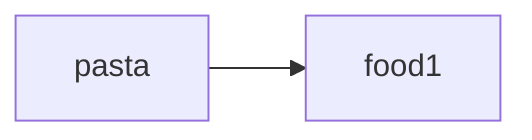
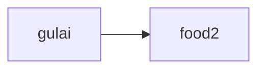
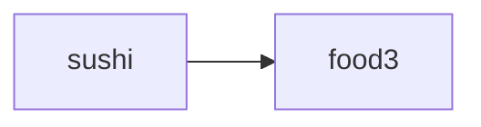
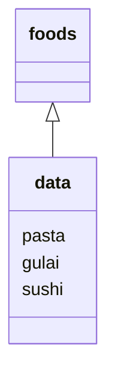

# Mari Mulai
Pada pelajaran ini, kita akan belajar bagaimana mengelola kumpulan data dan bekerja dengan loop.
Kita juga akan memperbarui aplikasi belanja dengan pengetahuan baru ini.
Tidak akan sesulit kedengarannya, kok. Santai!
# Menyusun Data
## List
### Menyusun Data
Mari belajar bagaimana mengelola sekelompok data dengan satu variable. Ketika ada daftar nama-nama makanan, sebagai contoh, tidak efisien untuk menamainya dengan variable terpisah, seperti `food1`, `food2`, `food3`. Akan lebih baik untuk mempunyai variable `foods` untuk mengelola keseluruhan daftar tersebut.
> **Variabel** Mengelola data secara **mandiri**
{.is-info}



> **List** Mengelola sekelompok data secara **bersamaan**
{.is-info}

## List (Daftar)
Tipe data `list` memungkinkan Anda untuk mengelola sekelompok data sekaligus. Anda dapat membuat list sebagai berikut: `[element1, element2, ...]`. Setiap nilai di dalam list disebut `element`.
Dengan menggunakan list, Anda dapat mengelola banyak string dan integer dalam satu grup.

Membuat List
```
[element1, element2, element3]
# Pisahakan element dengan koma
```
Penggunaan
```python
# List dari beberapa string
["pasta", "gulai", "sushi"]

# List dari beberapa integer
[1, 2, 3, 5, 8, 13, 21]

# List dari item gabungan
[["apel", "pisang", 200, 300]
```
## Menetapkan List ke Variable
Seperti integer dan string, Anda dapat menentukan list ke dalam satu variable. Sesuai norma penamaan yang berlaku, nama variable bersifat plural, seperti `foods`, karena variable akan mengandung banyak element.

```python
foods = ["pasta", "gulai", "sushi"]  # foods = nama variabel
print(foods)

#Hasil: ["pasta", "gulai", "sushi"]
# List dicetak sebagaimana adanya
```

## Menentukan Element dalam List
Setiap element list dinomori `0, 1, 2, ....`
Ini disebut `nomor indeks`. Nomor indeks dimulai dari `0`. Anda bisa mendapatkan element individual dengan menulis `list[index]`.

Index
```python
["pasta", "gulai", "sushi]
	  0				1					2

# dimulai dari index 0
```
```python
foods = ["pasta", "gulai", "sushi"]
print("saya suka " + foods[2]) # Mengambil element menggunakan nomor index

# Element dengan index 2 dicetak
# Hasil: Saya suka sushi
```