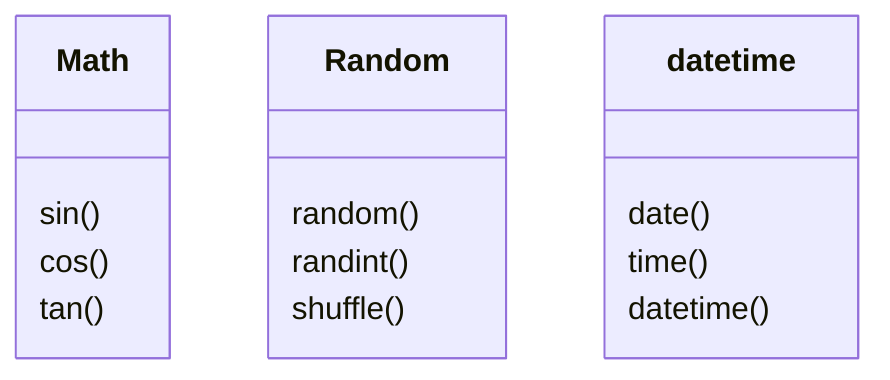

# Mari Mulai
Pada pelajaran ini, kita akan belajar bagaimana cara menggunakan `function` dan `module`.
Untuk membuat pelajaran ini menjadi lebih menyenangkan,
mari kita mempelajarinya sambil membuat permainan Batu Kertas Gunting.

# Function
## Function
Pertama-tama, mari kita lihat bagaimana `function` bekerja dalam Python. Function adalah bagian dari code yang menjalankan tugas tertentu. `print` adalah salah satu contoh function, yang memudahkan Anda untuk mencetak teks tanpa perlu untuk menulis banyak code.

### Lebih lanjut tentang function
Seperti `print`, ada banyak function yang sudah tersedia di Python yang dapat membuat coding lebih mudah. Jika tertarik, Anda juga dapat membuat function Anda sendiri.

### Mendefinisikan Function
Mari belajar bagaimana cara mendefinisikan function yang sederhana.
Sintaksis untuk mendefinisikan function adalah sebagai berikut:
`def function_name():`
Jangan lupa untuk mengindentasi code didalam function.
```python
def function_name():
___#Code 
#gunakan indentasi
```
Contoh
```python
def gree():
		print("halo")
```
### Memanggil Function
Function tidak akan dijalankan hanya dengan mendefinisikannya, Anda perlu `memanggil` function untuk menjalankan code didalamnya. Untuk memanggil sebuah function, Anda cukup menulis `function_name()`. Perlu diingat bahwa function hanya dapat dipanggil setelah Anda mendefinisikannya.
```python
def greet():
		print("halo")

greet()	# Memanggil function

#Hasil: halo
```
## Argument dan Parameter
### Apa Itu Argument?
Anda dapat memberikan nilai ke sebuah function ketika Anda memanggilnya. Nilai ini disebut `argument` dan dapat digunakan berulang kali di dalam sebuah function. Dengan menggunakan argument, Anda dapat membuat sebuah function untuk me-return nilai yang berbeda berdasarkan argument yang Anda berikan.

### Function dengan Argument
Untuk memberikan `argument` ke sebuah function, function harus mempunyai variable untuk menerimanya, variable ini di sebut `parameter`. Pada contoh di bawah, function <kbd>greet</kbd> memiliki parameter <kbd>name</kbd> untuk menerima sebuah argument.
```python
def function_name(parameter):
		              # variabel yang dibutuhkan
    #Code
```
```python
def greet(name):
		print("halo" + name)
```
### Memberikan Argument ke Sebuah Function
Kita bisa memberikan argument dengan memanggil sebuah function dengan: <kbd>function_name(argument)</kbd>. Saat function dipanggil, `argument` yang diberikan akan ditentukan ke `parameter` untuk digunakan di dalam function.
```python
def greet(name): # Parameter name
		print("halo" + name)
    
greet("john") # john diberikan ke parameter name
greet("kate")

#Hasil: halo john
#Hasil: halo kate
```
### Scope
Variable mempunyai `scope`, sesuatu yang merujuk ke rentang tertentu dimana variable dapat diakses. Scope dari parameter dan variable yang di definisikan didalam sebuah function akan terbatas pada function tersebut. Maka dari itu, mereka tidak dapat digunakan diluar function itu.
```python
def greet(name): # Parameter name
		print(name) # hanya dapat digunakan didalam function ini
    
print(name) <---- # diluar scope

# ERROR! - Variable name tidak dapat digunakan diluar function
```
## Beberapa Parameter
### Function dengan Banyak Parameter
Anda dapat menambahkan banyak parameter ke sebuah function dengan memisahkan parameter tersebut dengan tanda koma <kbd>,</kbd>.
Pada contoh dibawah, `name` adalah parameter pertama, dan `message` adalah parameter kedua.
```python
def greet(name, message):
		print(name + "," + message)
```
### Memberikan Beberapa Argument ke Sebuah Function
Contoh dibawah menunjukkan bagaimana cara memberikan beberapa argument ke sebuah function. Saat memberikan argument, Anda harus menulisnya sesuai dengan urutan penulisan parameter.
```python
def greet(name, message):
		print(name + "," + message)

greet("john", "senang bertemu anda")
       name					message
# Argumen harus diberikan sesuai urutan parameter

#Hasil: john, senang bertemu anda
```
## Nilai Default Parameter
### Nilai Default Parameter
Anda dapat mengatur nilai default parameter.
Nilai default akan digunakan ketika tidak ada argument yang disediakan untuk parameter.
```python
def greet(name, message="senang bertemu anda")
                 # Default parameter
		print(name + "," + message)
    
hello("john", "sampai ketemu lagi")
hello("kate")

#Hasil: john, senang ketemu lagi
#       kate, senang bertemu anda
```
# Aplikasi Batu Kertas Gunting
## Mendapatkan Masukan
### Batu Kertas Gunting
Sejauh ini, kita sudah belajar dasar-dasar function.
Sekarang, mari menggunakannya untuk membuat permainan Batu Kertas Gunting menjadi lebih baik!
### Menerima Nama Pengguna
Mari kita beri nama pengguna, lalu mencetaknya.
```python
def print_hand(hand, name='Tamu'):
    print(name + ' memilih: ' + hand)

print('Memulai Permainan Batu Kertas Gunting!')

# Dapatkan input, dan tetapkan ke variable player_name
player_name = input('Masukkan nama Anda: ')

# Tambahkan argument ke dua ke print_hand
print_hand('Batu', player_name)
```

## Memilih Tangan
Mari biarkan pengguna memilih tangan dengan nomor `0`, `1`, atau `2`.
Kita akan menyiapkan list yang berisi `'Batu'`, `'Kertas'`, dan `'Gunting'`, dan saat pengguna memilih nomor, kita akan mencetak element yang sesuai dengan nomor index.
```python
def print_hand(hand, name='Tamu'):
    # Tetapkan list hands ke variable hands 
    hands = ['Batu', 'Kertas', 'Gunting']
    
    # Memperbarui dengan menggunakan element dari variable hands 
    print(name + ' memilih: ' + hands[hand])

print('Memulai Permainan Batu Kertas Gunting!')
player_name = input('Masukkan nama Anda: ')
# Cetak 'Pilih tangan: (0: Batu, 1: Kertas, 2: Gunting)'
print('Pilih tangan: (0: Batu, 1: Kertas, 2: Gunting)')

# Dapatkan input, ubah, dan tetapkan ke variable player_hand 
player_hand = int(input('Masukkan nomor (0-2): '))

# Ubah argument pertama ke player_hand
print_hand(player_hand, player_name)
```
## Nilai Return
### Memvalidasi Nilai Input
Sejauh ini, program kita menghasilkan erorr jika pengguna memasukkan nomor selain `0`, `1`, atau `2` sehingga kita perlu memvalidasinya.
Untuk melakukannya, kita akan belajar topik selanjutnya, nilai return.
### Apa itu Nilai Return?
Saat kita ingin menggunakan hasil dari sebuah function, kita dapat menggunakan <kbd>return</kbd>. Pada contoh di bawah, function `add` menjadikan `3` dan `7` sebagai argument, dan mengembalikan `10` ke pemanggilnya.
### Function dengan Nilai Return
Untuk mengirim nilai ke asal sebuah function yang dipanggil, kita menggunakan statement `return`. Dengan menulis `return nilai`, nilai dapat dikembalikan untuk digunakan di luar function.
```python
def function_name():
		return nilai 		# return nilai ke tempat dimana  function dipanggil
```
```python
def add(a, b):
		return a + b    # return jumlahnya ke tempat dimana function dipanggil
```
### Menerima Nilai Return

Saat Anda memanggil sebuah function yang mempunyai `nilai return`, pemanggil akan digantikan dengan nilai.
Pada contoh di bawah, `add(1,3)` akan digantikan dengan `4`, dan disimpan ke variable `sum`.
```python
def add(a, b):
		return a + b
sum = add(1, 3)
print(sum)

#Hasil: 4
```
## Return
### Bagaiman Return Bekerja
`Return` tidak hanya mengirim balik nilai return ke pemanggil, namun juga menghentikan function. Ini berarti, apapun yang tertulis setelah `return` pada function tidak akan di jalankan.
```python
def add(a, b):
		return a + b
    print("hello world")  # Baris setelah return tidak akan dijalankan
sum = add(1, 3)
print(sum)

#Hasil: 4
# "Hello world" tidak dicetak 
```
### Beberapa Return
Dengan menambahkan control flow, Anda dapat menggunakan `return` berkali-kali. Pada contoh di bawah, jika nilai parameter `name` sama dengan `'Tamu'`, function akan berakhir setelah mengembalikan `'Siapa nama Anda?'`. Code setelahnya tidak akan di jalankan.
```python
def greet(name = "tamu"):
		if name == "tamu":
    		return "siapa nama anda?"
    return name + ",selamat datang"
print (greet())

#Hasil: siapa nama anda?
```
# Aplikasi Batu Kertas Gunting (2)
## Menambah Komputer
Dari sini, kita akan menyelesaikan permainan Batu Kertas Gunting.
Kita akan menambahkan function sehingga pengguna dapat bermain melawan komputer. Selain itu, kita juga akan belajar tentang `module`.
## Memilih Tangan
Mari memulai dengan mencetak tangan yang dipilih oleh komputer.

script.py
```python
def validate(hand):
    if hand < 0 or hand > 2:
        return False
    return True

def print_hand(hand, name='Tamu'):
    hands = ['Batu', 'Kertas', 'Gunting']
    print(name + ' memilih: ' + hands[hand])

print('Memulai permainan Batu Kertas Gunting!')
player_name = input('Masukkan nama Anda: ')

print('Pilih tangan: (0: Batu, 1: Kertas, 2: Gunting)')
player_hand = int(input('Masukkan nomor (0-2): '))

if validate(player_hand):
    # Tetapkan 1 ke variable computer_hand 
    computer_hand = 1
    
    print_hand(player_hand, player_name)
    # Panggil function print_hand dengan computer_hand dan 'Komputer' sebagai argument
    print_hand(computer_hand, 'Komputer')
    
else:
    print('Mohon masukkan nomor yang benar')
```
## Menilai Pemenang
Mari membuat function untuk menilai siapa yang memenangkan permainan.

script.py
```python
def validate(hand):
    if hand < 0 or hand > 2:
        return False
    return True

def print_hand(hand, name='Tamu'):
    hands = ['Batu', 'Kertas', 'Gunting']
    print(name + ' memilih: ' + hands[hand])

# Definisikan function judge 
def judge(player, computer):
    # Tambahkan control flow berdasarkan perbandingan antara player dan computer
    if player == computer:
        return 'Seri'
    elif player == 0 and computer == 1:
        return 'Kalah'
    elif player == 1 and computer == 2:
        return 'Kalah'
    elif player == 2 and computer == 0:
        return 'Kalah'
    else:
        return 'Menang'

print('Memulai permainan Batu Kertas Gunting!')
player_name = input('Masukkan nama Anda: ')

print('Pilih tangan: (0: Batu, 1: Kertas, 2: Gunting)')
player_hand = int(input('Masukkan nomor (0-2): '))

if validate(player_hand):
    computer_hand = 1
    
    print_hand(player_hand, player_name)
    print_hand(computer_hand, 'Komputer')
    
    # Tetapkan nilai return dari judge ke variable result 
    result = judge(player_hand, computer_hand)
    # Cetak variable result 
    print('Hasil: ' + result)
else:
    print('Mohon masukkan nomor yang benar')
```
## Menggunakan Module
### Membagi File
Code pada file `script.py` kita sudah menjadi sangat panjang.
Semakin panjang code Anda, akan semakin sulit untuk dibaca dan dimengerti, ini akan berpotensi menimbulkan bug yang tidak diinginkan. Untuk mencegah ini, mari belajar untuk membagi code ke beberapa file terpisah.
### Module
Kita dapat memindahkan sebagian code ke file terpisah, lalu, mengimportnya sebagai `module`. Module adalah file yang dapat diimport ke file lain. Dengan mengimport module, Anda dapat menggunakan function di dalam modul tersebut. Kita akan memindahkan beberapa function di dalam `script.py` ke `utils.py`.

pindahkan script ini ke `utils.py`
```python
def validate(hand):
		.
    .
def print_hand(hand, name="tamu"):
		.
    .
def judge(player, computer):
```
### Import
Anda dapat mengimport sebuah module menggunakan sintaksis berikut: `import nama_module`.
Ekstensi dari file, `.py`, dapat di abaikan ketika Anda mengimportnya.
```python
import utils    # import module utils
```
### Menggunakan Module
Anda dapat memanggil function dari sebuah module dengan meletakkan nama module sebelum nama function, seperti `module_name.function_name()`.

script.py
```python
import utils
	.
  .

#Pisahkan nama module dengan titik!
if utils.validate(player_hand):
		computer = 1
    utils.print_hand(player_hand, player_name)
      .
      .
```
### Penggunaan
script.py
```python
# Pindahkan ke 3 function dibawah ke utils.py
def validate(hand):
    if hand < 0 or hand > 2:
        return False
    return True

def print_hand(hand, name='Tamu'):
    hands = ['Batu', 'Kertas', 'Gunting']
    print(name + ' memilih: ' + hands[hand])

def judge(player, computer):
    if player == computer:
        return 'Seri'
    elif player == 0 and computer == 1:
        return 'Kalah'
    elif player == 1 and computer == 2:
        return 'Kalah'
    elif player == 2 and computer == 0:
        return 'Kalah'
    else:
        return 'Menang'

# import module utils


print('Memulai permainan Batu Kertas Gunting!')
player_name = input('Masukkan nama Anda: ')

print('Pilih tangan: (0: Batu, 1: Kertas, 2: Gunting)')
player_hand = int(input('Masukkan nomor (0-2): '))

# Panggil function validate milik module utils
if validate(player_hand):
    computer_hand = 1
    
    # Panggil function print_hand milik module utils 
    print_hand(player_hand, player_name)
    print_hand(computer_hand, 'Komputer')
    
    # Panggil function judge milik module utils 
    result = judge(player_hand, computer_hand)
    print('Hasil: ' + result)
else:
    print('Mohon masukkan nomor yang benar')
```

utils.py
```python
# Tempelkan ke 3 function disini
def validate(hand):
    if hand < 0 or hand > 2:
        return False
    return True

def print_hand(hand, name='Tamu'):
    hands = ['Batu', 'Kertas', 'Gunting']
    print(name + ' memilih: ' + hands[hand])

def judge(player, computer):
    if player == computer:
        return 'Seri'
    elif player == 0 and computer == 1:
        return 'Kalah'
    elif player == 1 and computer == 2:
        return 'Kalah'
    elif player == 2 and computer == 0:
        return 'Kalah'
    else:
        return 'Menang'
```
## Library Standar Python
### Menyelesaikan Permainan Batu Kertas Gunting
Akhirnya, mari membuat permainan menjadi lebih menyenangkan dengan membuat acak tangan komputer.
### Library Standar Python
Sebelumnya, kita belajar cara membuat module utils yang dibuat khusus. Python juga mempunyai daftar module bawaan yang dapat Anda gunakan, di dalam Library Standar Python.
Mari kita coba menggunakan salah satu dari module yang sangat berguna ini.


### Module Acak
Kita akan mengacak tangan yang dipilih komputer menggunakan function `randint` dari module `random`.
Dengan menulis `random.randint(x,y)`, Anda mendapat integer acak di antara `x` dan `y` inklusif.

script.py
```python
import utils
import random
if utils.validate(player_hand):
		computer_hand = random.randint(0, 2) dapatkan integer acak antara 0-2
       .
       .
```