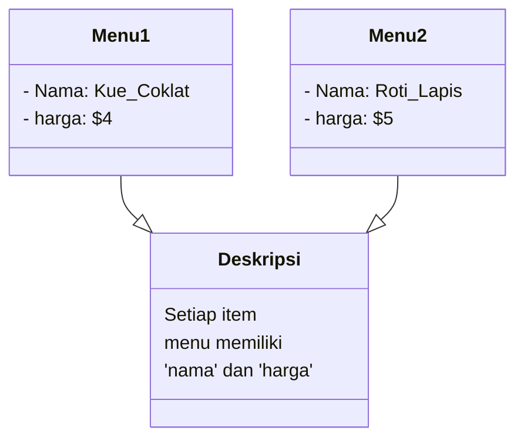
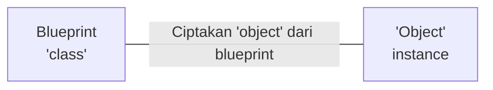

# Class dan Instance
## Gambaran
Kita akan mempelajari `class`. Ini adalah ilmu yang sangat penting dalam Python, jadi mari kita mempelajarinya dengan sungguh-sungguh!
> Anda dapat melihat ada item-item menu berbeda.
Kita akan memperlakukan tiap item menu sebagai tipe `object` yang sama, ini akan memudahkan kita untuk mengelola itemnya dengan nomor.
### Pemahaman Produk
Pertama, mari kita lihat bagaimana aplikasi pemesanan makanan akan bekerja. Saat berjalan, program akan menerima nomor item menu dan kuantitasnya sesuai dengan yang dimasukkan pengguna.
## Definisi Class
item menu memiliki detail seperti `nama` dan `harga` seperti ditunjukkan pada gambar di kanan.

### Membuat Object
Untuk membuat object untuk item-item pada menu, terlebih dahulu kita harus menyiapkan `blueprint`.
Blueprint diketahui sebagai `class`, dan object-nya disebut `instance`. Pastikan Anda mengingat istilah ini ya!
